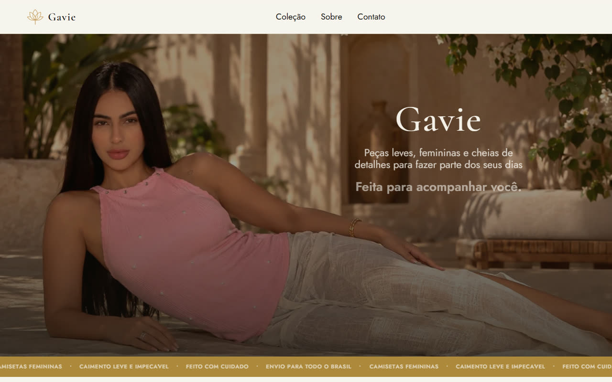

# Gavie

Landing page para a **Gavie**, marca de camisetas e regatas femininas — projeto freelance, do design (Figma) à implementação.

🔗 **Site:** [gavie.me](https://gavie.me)



## Sobre o projeto

Site institucional estático, construído do zero a partir de um design no
Figma, com foco em apresentar o catálogo da marca e direcionar o cliente
para fechar a compra via WhatsApp — sem carrinho, sem backend, sem painel
de admin: só uma vitrine rápida, bonita e fácil de manter.

## Status

🚧 **Em finalização.** Ainda faltam:

- Configurar o número de WhatsApp real (está com um placeholder).
- Alinhar o catálogo do site com as peças atualmente disponíveis na loja.

A loja está em hiato no momento — deu uma pausa nas vendas para focar em
outro projeto — mas a volta já está prevista, e o site foi encomendado
para estar pronto quando isso acontecer.

## Tecnologias

- HTML5 semântico
- Tailwind CSS v4
- JavaScript vanilla (ES Modules) — sem framework
- Sem backend — site 100% estático, publicado no Cloudflare Pages

## Funcionalidades

- Catálogo com troca de foto por cor selecionada
- Modal de guia de tamanhos
- Pedido via WhatsApp com mensagem pré-preenchida (produto, cor, tamanho)
- Animações de entrada suaves, respeitando `prefers-reduced-motion`
- Totalmente responsivo (mobile → desktop) e acessível (ARIA, navegação
  por teclado, foco visível)

## Rodando localmente

```bash
npm install
npm run dev   # build + Tailwind em watch + servidor em http://localhost:5173
```

---

Projeto comercial desenvolvido para um cliente real; código disponibilizado
aqui para fins de portfólio.
